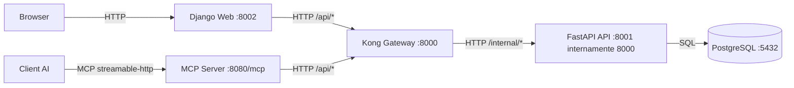
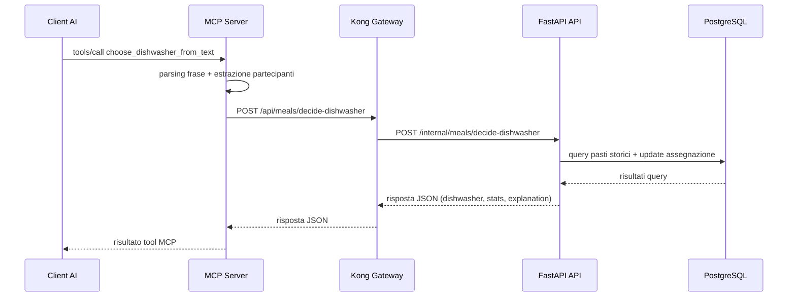
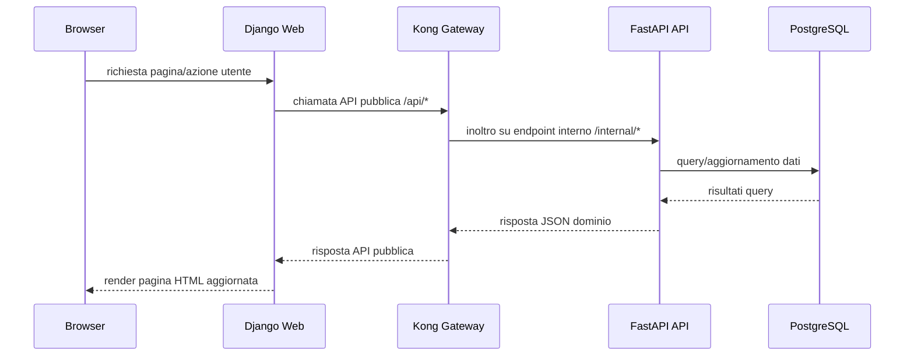

# Cucinometro - Flussi di Comunicazione

Questo documento spiega chi comunica con chi nel sistema Cucinometro e in quale ordine.

## Componenti

- Browser utente
- Web app Django (servizio `web`)
- API Gateway Kong (servizio `gateway`)
- API dominio FastAPI (servizio `api`)
- Database PostgreSQL (servizio `db`)
- MCP Server (servizio `mcp`)
- Client AI esterno (es. Copilot Chat, client MCP)

## Regola architetturale principale

I dati di dominio (membri, pasti, assegnazioni lavapiatti) passano sempre dal Gateway:

- `web` NON chiama direttamente `api`, ma `gateway`
- `mcp` NON chiama direttamente `api`, ma `gateway`
- `api` e' l'unico servizio che parla direttamente con `db`

## Mappa delle comunicazioni

## Grafico di sequenza (richiesta AI)

Questo grafico mostra il percorso completo quando un client AI chiede: "chi lava i piatti?".

## Flusso 1: uso da interfaccia web

1. Il browser richiede una pagina a `web` (porta 8002).
2. `web` invia richieste API a `gateway` su `/api/...`.
3. `gateway` trasforma/instrada verso endpoint interni `/internal/...` su `api`.
4. `api` legge/scrive dati su `db`.
5. La risposta risale in senso inverso fino al browser.

## Grafico di sequenza (richiesta Web)

Questo grafico mostra il percorso completo quando un utente usa il sito Django.

## Flusso 2: uso da client AI via MCP

1. Il client AI invia una richiesta tool al servizio `mcp` su `http://localhost:8080/mcp`.
2. `mcp` (tool `choose_dishwasher` o `choose_dishwasher_from_text`) prepara payload JSON.
3. `mcp` chiama `gateway` su `/api/meals/decide-dishwasher`.
4. `gateway` inoltra a `api` su `/internal/meals/decide-dishwasher`.
5. `api` interroga `db`, calcola il lavapiatti, salva eventuale assegnazione.
6. La risposta torna a `mcp`, poi al client AI.

## Flusso 3: health check

- Web/API check tecnico:
  - `GET /api/health` (via gateway)
- MCP check tecnico:
  - tool `health_check` su server MCP
  - internamente fa `GET /api/health` verso gateway

## Porte e endpoint principali

- Web UI: `http://localhost:8002`
- Gateway pubblico: `http://localhost:8000`
- API diretta (debug): `http://localhost:8001`
- MCP endpoint: `http://localhost:8080/mcp`
- DB: `localhost:5432`

## Cosa NON deve accadere

- Client AI -> API FastAPI diretta (bypass gateway)
- Django Web -> API FastAPI diretta (bypass gateway)
- Qualsiasi componente diverso da `api` -> `db`

Questi bypass rompono il disaccoppiamento previsto dall'architettura del progetto.
